# METRIC

## Sistema de Rastreamento e Visualização de Produtividade

**Versão:** 1.3
**Desenvolvedor:** Gustavo Henrique Pereira dos Santos
**Data:** 24 de Agosto de 2026

---

# Tabela de Revisão

| Versão | Autores          | Descrição                                                                                   | Data       |
| ------ | ---------------- | ------------------------------------------------------------------------------------------- | ---------- |
| 1.0    | Gustavo Henrique | Versão Inicial consolidada (ADR-001 + Core Sync)                                            | 07/03/2026 |
| 1.1    | Gustavo Henrique | Arquitetura do Timer Service, Schema de TimeEntries, Journal e timerConfig                  | 10/05/2026 |
| 1.2    | Gustavo Henrique | Revisão arquitetural: camadas Domain/Application/Main/Renderer, modelo operacional do timer | 10/05/2026 |
| 1.3    | Gustavo Henrique | Simplificação: SDK de Addons Multicapacidade, Política Zero-Cloud, Free vs Pro e Licenciamento Local | 24/08/2026 |

---

# 1. Introdução

## 1.1 Finalidade

O **METRIC** é um sistema desktop extensível e focado em produtividade para desenvolvedores e equipes de tecnologia.

O sistema atua como um **hub local e agnóstico** que se conecta diretamente a ferramentas de gestão externas (Redmine, Jira, etc.) através de um **SDK de Addons Multicapacidade**, gerenciando o tempo investido com operação **100% offline-first e privacidade absoluta (Zero-Cloud)**.

## 1.2 Política de Privacidade Estrita (Zero-Cloud Data Policy)

O Metric adota uma política rigorosa de **não exfiltração de dados operacionais**:
- **Nenhum dado de tarefas, títulos de janelas, apontamentos de horas ou informações de clientes trafega para servidores em nuvem do Metric ou de terceiros.**
- Todas as conexões com DataSources acontecem **diretamente da máquina do usuário para o servidor da empresa/ferramenta**.
- Recursos de inteligência e automação (Window Observer, Git Tracker, OCR, Idle Resolver) executam **100% localmente** na CPU do usuário.

---

# 2. Visão Geral e Modelo de Negócio

## 2.1 Público-Alvo

- **Desenvolvedores Individuais (CLT / Solo):** Rastreamento de tempo ágil, sem fricção, com widget flutuante e atalhos rápidos.
- **Desenvolvedores PJ / Freelancers / Consultores:** Gestão de múltiplos clientes/workspaces simultâneos, automação de apontamento e exportação de faturamento.
- **Equipes de Tecnologia e Agências:** Visão de capacidade, alocação e relatórios centralizados.

## 2.2 Divisão de Planos (Free vs Pro)

O Metric opera sob um modelo de licenciamento local simplificado (sem necessidade de cadastro ou login obrigatório):

### 🟢 Plano FREE (Uso Individual / Básico)
- Timer manual com precisão no Main Process.
- Widget flutuante com suporte a *click-through* e atalhos globais.
- 1 Conexão de DataSource ativa por vez.
- Temas nativos da aplicação (Light & Dark padrão).
- Armazenamento 100% local.

### 💎 Plano PRO (Automações & Multi-Workspaces)
Ativado localmente via **Chave de Licença (License Key)**:
- **Multi-Workspace & Múltiplas Conexões:** Conectar simultaneamente múltiplos DataSources (ex: Jira + Redmine + GitHub).
- **Pacote de Automações & Watchers Locais:**
  - *Window Context Observer:* Identificação de janelas ativas em primeiro plano.
  - *Git Tracker:* Associação automática de branches/commits a tarefas.
  - *Idle Resolver:* Detecção e tratamento inteligente de pausas e reuniões.
  - *Sugestor Automático:* Captura de atividades (Discord, Calls) com pré-preenchimento heurístico.
  - *Gerador de Daily:* Resumo automático do dia anterior em tópicos para reuniões diárias.
- **Temas e Customização Visual Ilimitada:** Aplicação de temas da comunidade via Addons e injeção de CSS personalizado.
- **Exportação de Faturamento:** Geração de relatórios consolidados em PDF e planilhas para cobrança de horas.

---

# 3. Ecossistema e SDK de Addons

O Metric possui uma arquitetura orientada a **Addons Multicapacidade**. Um único pacote de addon pode fornecer simultaneamente:

1. **DataSources:** Adaptadores de comunicação com APIs externas (Redmine, Jira, GitLab, Mock).
2. **Navegação & Menus:** Injeção de itens de navegação na Sidebar e subitens.
3. **Timerbar & Popovers:** Botões de ação rápida, atalhos de teclado e popovers interativos na barra do timer.
4. **Comandos (Commands):** Handlers executáveis registrados no barramento de eventos local.
5. **Temas Visuais (Themes):** Folhas de estilo completas injetadas dinamicamente no DOM da aplicação e do widget.
6. **Watchers & Observadores:** Automações em background para monitorar eventos do sistema operacional.

---

# 4. Ambiente Operacional

### Requisitos de Sistema
- **Sistemas Operacionais:** Windows 10/11, macOS, Linux
- **Stack Técnica:** Electron, TypeScript, React, Tailwind CSS v4, RxDB (Persistência Local)
- **Privacidade & Rede:** Totalmente funcional offline. Acesso à internet necessário apenas para sincronizar com os DataSources externos configurados pelo próprio usuário e para a validação pontual da Chave de Licença.

---

# 5. Especificação dos Requisitos

## 5.1 Requisitos Funcionais (RF)

| ID    | Descrição                                         | Prioridade | Depende De |
| ----- | ------------------------------------------------- | ---------- | ---------- |
| ID    | Descrição                                                         | Prioridade | Depende De |
| ----- | ----------------------------------------------------------------- | ---------- | ---------- |
| RF001 | Gestão de Workspaces locais independentes                         | Alta       | —          |
| RF002 | Gerenciador e SDK de Addons Multicapacidade                       | Alta       | —          |
| RF003 | Configuração de conexões externas diretas                         | Alta       | RF002      |
| RF004 | Motor de sincronização Pull/Push direto com DataSources           | Alta       | RF003      |
| RF005 | Conversão de metadados para padrão interno agnóstico              | Alta       | RF004      |
| RF006 | Sistema de timer processado em background                         | Alta       | —          |
| RF007 | Widget flutuante com suporte a click-through e atalhos            | Alta       | RF006      |
| RF008 | Injeção dinâmica de temas CSS via Addons                          | Alta       | RF002      |
| RF009 | Validação de Chave de Licença PRO (License Key) offline-first     | Média      | —          |
| RF010 | Temporização manual e recuperação de estado (Boot Recovery)       | Alta       | RF006      |
| RF011 | Journal de eventos do timer e auditoria local                     | Alta       | RF006      |
| RF012 | Pacote de Watchers e Automações Locais (Window/Git/Idle/Sugestor) | Média      | RF002, RF009 |

## 5.2 Requisitos Não Funcionais (RNF)

| ID     | Descrição                                                                      | Categoria      | Prioridade |
| ------ | ------------------------------------------------------------------------------ | -------------- | ---------- |
| RNF001 | Política Estrita Zero-Cloud (Nenhum dado operacional enviado a servidores)     | Privacidade    | Crítica    |
| RNF002 | Persistência local offline-first (RxDB / SQLite)                               | Arquitetura    | Alta       |
| RNF003 | Timer imune a throttling do Chromium (Processado no Electron Main)             | Performance    | Alta       |
| RNF004 | Separação estrita em camadas (Domain, Application, Main, Renderer, SDK, UI)   | Arquitetura    | Alta       |
| RNF005 | Extensibilidade agnóstica via SDK (Zero acoplamento com ferramentas específicas)| Arquitetura    | Alta       |
| RNF006 | Injeção de CSS tratada para compatibilidade com Tailwind v4 no Client-Side     | Compatibilidade| Alta       |

---

# 6. Dicionário de Dados

Persistência local realizada através de **RxDB**.

Coleções principais:

- `tasks`
- `timeEntries`
- `metadata`

---

# 6.1 Coleção: tasks

Representa tarefas sincronizadas a partir de sistemas externos.

| Campo          | Tipo     | Descrição                             |
| -------------- | -------- | ------------------------------------- |
| \_id           | String   | Chave primária local                  |
| id             | String   | ID da tarefa na fonte externa         |
| title          | String   | Título da tarefa                      |
| description    | String   | Descrição da tarefa                   |
| url            | String   | URL da tarefa na ferramenta externa   |
| projectName    | String   | Nome do projeto                       |
| status         | Object   | Status atual da tarefa                |
| tracker        | Object   | Tipo de issue                         |
| priority       | Object   | Prioridade da tarefa                  |
| author         | Object   | Usuário criador                       |
| assignedTo     | Object   | Usuário responsável                   |
| createdAt      | DateTime | Data de criação                       |
| updatedAt      | DateTime | Data da última atualização            |
| startDate      | DateTime | Data de início                        |
| dueDate        | DateTime | Data limite                           |
| doneRatio      | Number   | Percentual de conclusão               |
| spentHours     | Number   | Horas gastas registradas externamente |
| estimatedTimes | Array    | Estimativas de tempo                  |
| statusChanges  | Array    | Histórico de mudança de status        |
| participants   | Array    | Participantes da tarefa               |
| timeEntryIds   | Array    | IDs dos apontamentos relacionados     |
| timeEntries    | Array    | Apontamentos vinculados               |
| conflicted     | Boolean  | Indica conflito de sincronização      |
| conflictData   | Object   | Dados de conflito                     |
| syncedAt       | DateTime | Última sincronização                  |

---

# 6.2 Coleção: timeEntries

Representa registros de tempo vinculados a tarefas. Esta coleção possui duas categorias de campos:

- **Campos sincronizados** — enviados e recebidos do servidor
- **Campos locais** — existem apenas no RxDB, nunca trafegam para o servidor

## Campos Sincronizados

| Campo                | Tipo     | Descrição                                                                                                                                                                                |
| -------------------- | -------- | ---------------------------------------------------------------------------------------------------------------------------------------------------------------------------------------- |
| \_id                 | String   | Chave primária local — formato `dataSourceId::id`                                                                                                                                        |
| \_deleted            | Boolean  | Soft delete para controle de sync                                                                                                                                                        |
| id                   | String   | ID do apontamento na fonte externa                                                                                                                                                       |
| dataSourceId         | String   | Identifica a origem do dado                                                                                                                                                              |
| connectionInstanceId | String   | Identifica a conexão ativa                                                                                                                                                               |
| task                 | Object   | Referência da tarefa `{ id }`                                                                                                                                                            |
| taskData             | Object   | Snapshot/cache local da task (desnormalizado)                                                                                                                                            |
| activity             | Object   | Tipo de atividade `{ id, name? }`                                                                                                                                                        |
| user                 | Object   | Usuário responsável `{ id, name? }`                                                                                                                                                      |
| startDate            | DateTime | **Fonte de verdade do timer.** Quando o cronômetro começou a contar. Em casos de tempo inicial manual ou retomada após pausa, é recalculado retroativamente como `now - secondsAtMoment` |
| endDate              | DateTime | Preenchido no stop. Enviado ao servidor junto com startDate                                                                                                                              |
| timeSpent            | Number   | Tempo acumulado localmente pelo renderer (em horas). Calculado a partir dos segundos acumulados durante a sessão de timer. Enviado ao datasource externo no momento do push via adapter  |
| comments             | String   | Observações livres do usuário                                                                                                                                                            |
| timeStatus           | Enum     | Estado do timer — ver seção 6.2.1                                                                                                                                                        |
| type                 | Enum     | Modo de operação — ver seção 6.2.2                                                                                                                                                       |
| createdAt            | DateTime | Data de criação do registro                                                                                                                                                              |
| updatedAt            | DateTime | Data da última atualização                                                                                                                                                               |
| conflicted           | Boolean  | Flag de conflito de sincronização                                                                                                                                                        |
| conflictData         | Object   | Dados do conflito `{ server, local }`                                                                                                                                                    |
| validationError      | Object   | Erros de validação do servidor                                                                                                                                                           |
| syncedAt             | DateTime | Última sincronização com o servidor                                                                                                                                                      |
| assumedMasterState   | Object   | Usado pelo RxDB para resolução de conflitos                                                                                                                                              |

## Campos Locais (nunca sincronizados)

| Campo       | Tipo   | Descrição                                                                 |
| ----------- | ------ | ------------------------------------------------------------------------- |
| journal     | Array  | Histórico de eventos do timer — ver seção 6.2.3                           |
| timerConfig | Object | Configurações do timer para este apontamento específico — ver seção 6.2.4 |

## 6.2.1 `timeStatus` — Estados e Transições

| Status     | Significado                                                              | Próximos estados possíveis |
| ---------- | ------------------------------------------------------------------------ | -------------------------- |
| `running`  | Timer ativo, contando                                                    | `paused`, `finished`       |
| `paused`   | Pausado pelo usuário. Entry visível, pode ser retomado ou encerrado      | `running`, `finished`      |
| `finished` | Encerrado definitivamente por ação do usuário ou por sistema (countdown) | —                          |

Não existe status `idle` no RxDB. Um entry que ainda não foi iniciado simplesmente não existe no banco.

## 6.2.2 `type` — Modos de Operação

| Valor        | Significado                                                        |
| ------------ | ------------------------------------------------------------------ |
| `increasing` | Countup — começa do zero (ou de um offset manual) e cresce         |
| `decreasing` | Countdown — começa de um valor definido e decrementa até zero      |
| `manual`     | Entrada manual de tempo sem timer ativo. Não aciona o TimerService |

## 6.2.3 `journal` — Histórico de Eventos do Timer

Array **local**, nunca sincronizado. Cada entrada registra um evento que ocorreu com o timer, permitindo auditoria, recálculo e exibição de histórico ao usuário.

Estrutura de cada entrada:

| Campo          | Tipo     | Obrigatório | Descrição                                                    |
| -------------- | -------- | ----------- | ------------------------------------------------------------ |
| event          | Enum     | Sim         | Tipo do evento — ver tabela abaixo                           |
| at             | DateTime | Sim         | Momento exato em que o evento ocorreu                        |
| secondsAtEvent | Number   | Sim         | Quantos segundos o timer marcava no momento do evento        |
| note           | String   | Não         | Observação livre (ex: "usuário ajustou manualmente para 6h") |

Tipos de evento:

| Evento     | Quando é gerado                                                             |
| ---------- | --------------------------------------------------------------------------- |
| `started`  | Timer iniciado do zero pelo usuário                                         |
| `adjusted` | Timer iniciado com tempo manual (startDate retroativo). Substitui `started` |
| `paused`   | Timer pausado pelo usuário                                                  |
| `resumed`  | Timer retomado após pausa                                                   |
| `stopped`  | Timer encerrado definitivamente (stop ou countdown zerou)                   |

## 6.2.4 `timerConfig` — Configuração Local do Timer

Objeto **local**, nunca sincronizado. Guarda preferências do usuário para aquele apontamento específico.

| Campo                | Tipo   | Obrigatório | Descrição                                            |
| -------------------- | ------ | ----------- | ---------------------------------------------------- |
| mode                 | Enum   | Sim         | `countup` ou `countdown`                             |
| manualInitialSeconds | Number | Não         | Segundos definidos manualmente como ponto de partida |

---

# 6.3 Coleção: metadata

Armazena metadados provenientes da fonte externa.

| Campo            | Tipo     | Descrição                   |
| ---------------- | -------- | --------------------------- |
| \_id             | String   | Chave primária              |
| taskStatuses     | Array    | Status possíveis de tarefas |
| taskPriorities   | Array    | Prioridades                 |
| activities       | Array    | Tipos de atividades         |
| trackStatuses    | Array    | Status de tracking          |
| participantRoles | Array    | Papéis de participantes     |
| estimationTypes  | Array    | Tipos de estimativa         |
| conflicted       | Boolean  | Indica conflito             |
| conflictData     | Object   | Dados de conflito           |
| syncedAt         | DateTime | Última sincronização        |

Cada item de metadata contém:

| Campo  | Tipo   |
| ------ | ------ |
| id     | String |
| name   | String |
| icon   | String |
| colors | Object |

Estrutura de cores:

| Campo      | Tipo   |
| ---------- | ------ |
| badge      | String |
| background | String |
| text       | String |
| border     | String |

---

# Diagrama de Classes

<!--<BEGIN_CLASSES_DIAGRAM> -->
###### diagram-classes-001-tasks.puml
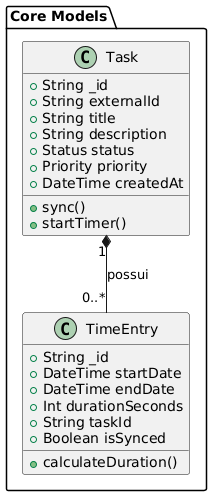

###### diagram-classes-002-timeEntries.puml
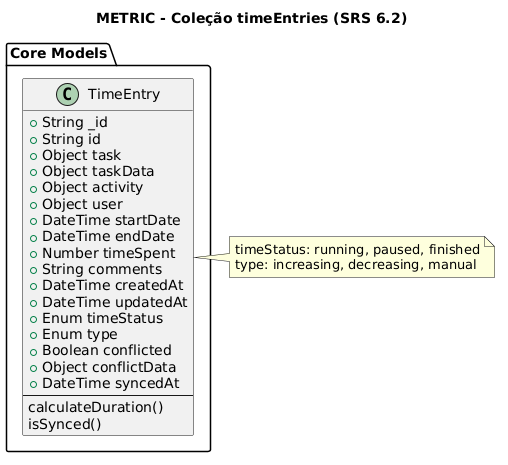

###### diagram-classes-003-metadata.puml
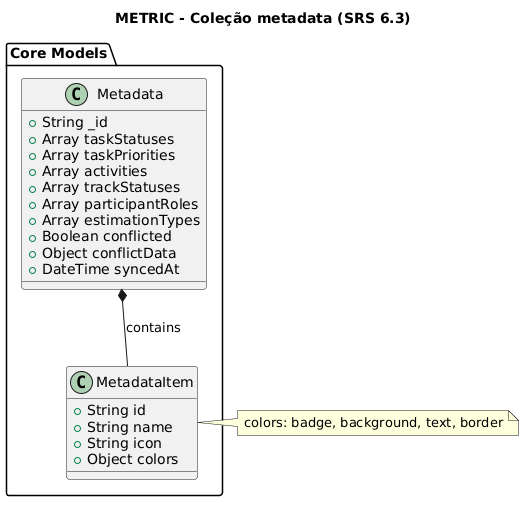

###### diagram-classes-004-license-plan.puml
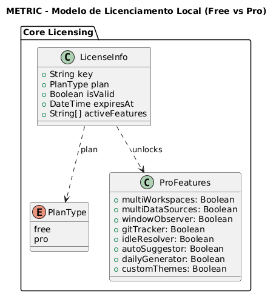
<!--END_CLASSES_DIAGRAM -->

---

# 7. Arquitetura em Camadas

O Metric é estruturado em quatro camadas com responsabilidades bem delimitadas, consistentes com os princípios de DDD e com o modelo desktop offline-first.

## 7.1 Domain

Camada de regras de negócio puras. Não conhece Electron, RxDB, IPC, UI ou qualquer mecanismo de runtime.

Responsabilidades:

- Definição de entidades e invariantes
- Validação de consistência de estado
- Derivação de valores quando dados suficientes são fornecidos

Exemplo de entidade: `TimeEntry`

O domínio pode validar:

- `endDate >= startDate`
- `timeSpent` compatível com o intervalo entre datas
- Campos obrigatórios presentes antes de um push

O domínio **não executa relógio**, **não possui `onTick`** e **não mantém nenhum loop temporal**. A contagem incremental de tempo não é responsabilidade desta camada.

## 7.2 Application

Camada de orquestração. Coordena o fluxo entre domínio e infraestrutura, sem conhecer detalhes de UI ou Electron.

Responsabilidades:

- Execução de pull e push via adapters
- Resolução e injeção de datasources externos
- Detecção e tratamento de conflitos de sincronização
- Coordenação entre repositórios locais e fontes externas

Exemplo de serviço: `TimeEntriesPushService`

Datasources externos (Redmine, Jira, outros) são injetados nessa camada como adapters plugáveis. A camada de application **não executa timer de runtime** e não possui lógica de acumulação temporal.

## 7.3 Electron Main Process

Camada de infraestrutura e processamento de background. Atua como ponte entre o sistema operacional e o renderer, e é responsável pelo processamento do timer em tempo real.

Responsabilidades:

- Processamento do timer: mantém o interval ativo, calcula o tempo decorrido e emite eventos periódicos para o renderer
- Exposição de API via IPC para o renderer
- Gerenciamento de jobs assíncronos e event emitters nativos
- Bridge entre serviços de infraestrutura e a interface

O Main Process **não conhece** entidades de domínio, RxDB ou regras de negócio. Ele recebe parâmetros numéricos do renderer, executa o processamento temporal e devolve resultados via IPC.

Exemplos de componentes: handlers, preload, invokers, `ElectronJobEventEmitter`

## 7.4 Renderer

Camada de interface e runtime interativo. É responsável pelo estado visual, pela interação do usuário e pela orquestração local do ciclo de vida de um apontamento.

Responsabilidades:

- Controle do ciclo de vida do timer: play, pause, resume, stop
- Comunicação com o Main Process via IPC para iniciar e encerrar o processamento temporal
- Persistência local dos apontamentos no RxDB
- Leitura e exibição dos dados locais
- Atualização do display com os valores recebidos do Main Process
- Execução do boot recovery ao inicializar o app

O renderer é a camada que **decide o que fazer** com o tempo. O Main Process é a camada que **processa o tempo** de forma confiável e independente do estado da janela.

---

# 7.5 Modelo Operacional do Timer

Esta seção descreve como o timer opera na prática, separando o estado efêmero de execução do registro consolidado e sincronizável.

## Estado de execução local vs. Registro sincronizável

Existe uma distinção fundamental entre dois conceitos que convivem no sistema:

**Estado de execução local** — comportamento efêmero de runtime. Representa o que está acontecendo agora: o timer está rodando, pausado ou acumulando tempo. Esse estado pertence ao renderer e ao Main Process. Não é enviado ao datasource externo diretamente.

**Registro sincronizável (`TimeEntry`)** — documento persistível que representa um apontamento consolidado. Contém `startDate`, `endDate`, `timeSpent` e `comments`. É o objeto que participa de pull, push, detecção de conflito e persistência local no RxDB.

A transição entre os dois ocorre no momento do stop: o estado efêmero é consolidado em um `TimeEntry` com `timeSpent` calculado, pronto para ser enviado ao datasource externo no próximo push.

## Exemplo 1 — Criação local com timer

- Usuário inicia timer às 10:00
- Main Process começa a processar o interval e emite ticks para o renderer
- Usuário pausa às 10:12
- Renderer recebe o valor acumulado: **720 segundos**
- RxDB é atualizado localmente com `timeStatus: paused` e o journal registra o evento

Nenhum push é obrigatório nesse momento. O registro permanece local até que o usuário decida sincronizar.

## Exemplo 2 — Entrada importada e editada localmente

- Entrada existente foi importada do Redmine via pull
- Usuário edita localmente: altera tempo, comentário, datas
- Essas alterações são persistidas no RxDB
- O datasource externo não é notificado

Somente após o usuário executar o push manual é que o adapter converte o modelo interno e envia ao Redmine.

## Fluxo geral: pull → persistência local → interação → push

```
Datasource externo (Redmine, Jira...)
  │
  └─ Pull via adapter
       │
       └─ Conversão: modelo externo → modelo interno
            │
            └─ Persistência local no RxDB
                 │
                 └─ UI opera sobre dados locais
                      │
                      ├─ Timer: renderer controla ciclo de vida
                      │         Main Process processa o interval
                      │         RxDB persiste estado intermediário
                      │
                      └─ Push manual via adapter
                           │
                           └─ Conversão: modelo interno → modelo externo
                                │
                                └─ Datasource externo atualizado
```

---

# 7.6 Arquitetura do Timer

## 7.6.1 Visão Geral

O timer é processado no **Main Process** do Electron e controlado pelo **Renderer**. Essa separação garante que o processamento temporal não seja afetado pelo throttling do Chromium em janelas minimizadas ou em background, e estabelece uma base para futuras funcionalidades como captura de janela ativa e idle detection.

O Renderer decide **quando** o timer deve iniciar, pausar ou parar. O Main Process é responsável por **processar** o interval com precisão e emitir os valores calculados de volta ao renderer via IPC.

## 7.6.2 Regras de Negócio Fundamentais do Timer

- Apenas **1 timer ativo por vez**. O RxDB nunca deve ter 2 entries com `timeStatus: running`.
- O **`timeSpent`** é calculado localmente pelo renderer a partir dos segundos acumulados durante a sessão, e enviado ao datasource externo no push via adapter.
- O **`startDate`** salvo no entry é a fonte de verdade local para reconstrução do timer. Se o app fechar com o timer rodando, o tempo decorrido é recalculado a partir dele no próximo boot.
- O Main Process **não conhece** RxDB, entidades de domínio, usuários ou regras de negócio. Recebe parâmetros numéricos, processa o interval e emite resultados.
- Campos `journal` e `timerConfig` são **exclusivamente locais** e nunca devem ser incluídos em operações de sync com datasources externos.

## 7.6.3 Responsabilidades por Camada

### Renderer

| Ação          | Responsabilidade                                                                                      |
| ------------- | ----------------------------------------------------------------------------------------------------- |
| Criar entry   | Inserir no RxDB com `startDate`, `timeStatus: running`, `timerConfig` e primeira entrada no `journal` |
| Iniciar timer | Enviar `timer:start` ao Main Process com segundos iniciais e modo                                     |
| Pausar timer  | Enviar `timer:pause`, atualizar `timeStatus` no RxDB e inserir evento no `journal`                    |
| Retomar timer | Recalcular `startDate`, enviar `timer:start`, inserir evento no `journal`                             |
| Parar timer   | Enviar `timer:stop`, consolidar `timeSpent`, preencher `endDate`, registrar no `journal`              |
| Exibir tempo  | Receber `timer:tick` do Main Process e atualizar o store/display                                      |
| Boot do app   | Verificar entry `running` no RxDB e retomar o processamento no Main Process                           |

### Main Process

| Ação            | Responsabilidade                                                  |
| --------------- | ----------------------------------------------------------------- |
| `timer:start`   | Iniciar o interval com os parâmetros recebidos                    |
| `timer:pause`   | Interromper o interval e preservar o estado atual                 |
| `timer:resume`  | Retomar o interval a partir dos segundos informados pelo renderer |
| `timer:stop`    | Encerrar o interval e limpar o estado interno                     |
| Tick a cada 1s  | Calcular os segundos decorridos e emitir `timer:tick` ao renderer |
| Countdown zerou | Detectar o término e emitir `timer:finished` ao renderer          |

## 7.6.4 `startDate` — Lógica de Reconstrução

O `startDate` é o ponto de ancoragem temporal do apontamento. O renderer utiliza `now - startDate` para reconstruir os segundos decorridos em qualquer momento, inclusive no boot recovery.

**Início padrão:**

```
startDate = now
```

**Início com tempo manual (ex: usuário define 6h):**

```
startDate = now - initialSeconds
```

Exemplo: usuário inicia às 10:00 com 6 horas → `startDate = 04:00`

**Retomada após pausa:**

```
startDate = now - secondsAtMomentOfPause
```

Garante que `now - startDate` continue retornando o valor correto sem somar fragmentos.

**Boot recovery (app reaberto com timer rodando):**

```
initialSeconds = now - startDate
```

O gap em que o app estava fechado é absorvido naturalmente. Nenhuma entrada adicional é inserida no journal.

## 7.6.5 Configuração Global do Timer

Armazenada em **localStorage** por ora. Guarda preferências que se aplicam a todos os novos apontamentos:

| Chave                         | Tipo                     | Descrição                              |
| ----------------------------- | ------------------------ | -------------------------------------- |
| `timer.defaultMode`           | `countup` \| `countdown` | Modo padrão ao iniciar um novo timer   |
| `timer.defaultInitialSeconds` | number (opcional)        | Tempo inicial padrão para novos timers |

Quando houver necessidade de sync entre dispositivos, migra para o RxDB.

## 7.6.6 IPC — Contrato de Comunicação

### Renderer → Main

| Canal          | Payload                    | Descrição                               |
| -------------- | -------------------------- | --------------------------------------- |
| `timer:start`  | `{ initialSeconds, mode }` | Inicia ou retoma o processamento        |
| `timer:pause`  | —                          | Interrompe o interval                   |
| `timer:resume` | `{ initialSeconds }`       | Retoma após pausa com segundos corretos |
| `timer:stop`   | —                          | Encerra e limpa o estado                |

### Main → Renderer

| Canal            | Payload       | Descrição               |
| ---------------- | ------------- | ----------------------- |
| `timer:tick`     | `{ seconds }` | Emitido a cada 1s       |
| `timer:finished` | —             | Countdown chegou a zero |

## 7.6.7 Plano de Implementação

### Passo 1 — Atualizar o Schema RxDB

Adicionar `journal` (array de eventos) e `timerConfig` (objeto) à interface `SyncTimeEntryRxDBDTO` e ao `timeEntriesSyncSchema`. Incrementar a versão do schema e criar a migration correspondente. Garantir que essas props estejam **excluídas da estratégia de replicação**.

### Passo 2 — Timer no Main Process

Criar o serviço de processamento temporal no Main Process. O serviço gerencia o interval, calcula os segundos decorridos e emite eventos para o renderer via IPC. Não conhece nenhum conceito de domínio — recebe parâmetros numéricos e emite valores numéricos.

### Passo 3 — IPC Handlers no Main

Registrar os handlers que recebem os comandos do renderer (`timer:start`, `timer:pause`, `timer:resume`, `timer:stop`) e delegam ao serviço de timer.

### Passo 4 — IPC Bridge no Renderer

Módulo no renderer que encapsula o `ipcRenderer`. O restante da UI não conhece IPC diretamente — apenas chama métodos desse bridge. Facilita testes e futuras migrações.

### Passo 5 — Atualizar o `timeEntryStore`

As actions `createNewTimeEntry`, `pauseCurrentTimeEntry`, `playCurrentTimeEntry` e `stopCurrentTimeEntry` passam a: escrever no `journal`, recalcular o `startDate` quando necessário e comunicar ao Main Process via IPC bridge. O store recebe os segundos via `timer:tick` e os expõe ao display.

### Passo 6 — Simplificar o TimerDisplay

Remove lógica de cálculo local do componente. Passa a ler segundos diretamente do store, que é alimentado pelos eventos `timer:tick` recebidos do Main Process.

### Passo 7 — Boot Recovery

Hook ou efeito que roda na inicialização do app. Busca entry `running` no RxDB, calcula `initialSeconds = now - startDate` e inicia o processamento no Main Process para reconstituir o estado sem nenhuma escrita no journal.

### Passo 8 — UI de Tempo Inicial Manual

Campo no formulário de início do timer que permite o usuário definir um offset de tempo. Ao confirmar: calcula `startDate` retroativo, preenche `timerConfig.manualInitialSeconds` e registra evento `adjusted` no journal.

### Passo 9 — Diretriz futura: separação RunningTimer / TimeEntry

A evolução natural do modelo é a separação explícita entre o estado efêmero de execução e o registro consolidado:

**RunningTimer** — estado local efêmero, não sincronizável:

| Campo                | Descrição                              |
| -------------------- | -------------------------------------- |
| `startedAt`          | Momento em que o interval foi iniciado |
| `accumulatedSeconds` | Segundos acumulados até o momento      |
| `status`             | `running`, `paused`                    |

**TimeEntry** — registro consolidado e sincronizável:

| Campo       | Descrição                                        |
| ----------- | ------------------------------------------------ |
| `startDate` | Âncora temporal do apontamento                   |
| `endDate`   | Momento de encerramento                          |
| `timeSpent` | Tempo total acumulado, derivado do runtime local |
| `comments`  | Observações do usuário                           |

Essa separação tornaria explícita a distinção entre o que é estado de execução e o que é dado persistível, reduzindo o acoplamento entre o ciclo de vida do timer e o modelo de sincronização.

---

# 8. Casos de Uso

## UC001 — Setup e Sincronização Inicial

### Objetivo

Configurar integração com a fonte externa e sincronizar dados.

### Fluxo

1. Usuário cria workspace local
2. Instala addon de integração
3. Configura credenciais da fonte externa
4. Sistema executa sincronização Pull
5. Dados são convertidos para o padrão interno
6. Banco local é populado

### Diagrama de Fluxos

<!--<BEGIN_FLOW> -->
###### diagram-flow-001-timer.puml
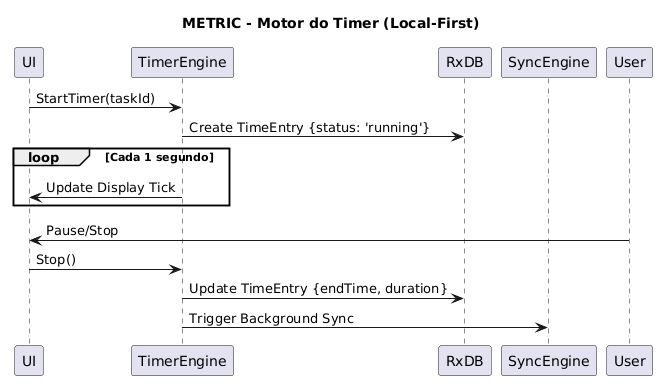

###### diagram-flow-002-task-creation.puml
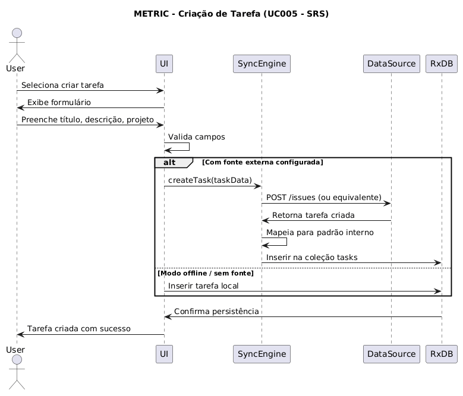

###### diagram-flow-003-task-edit.puml
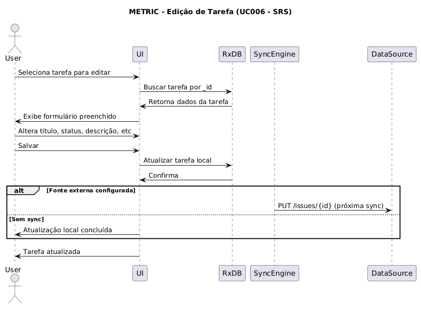

###### diagram-flow-004-plugin-activation.puml
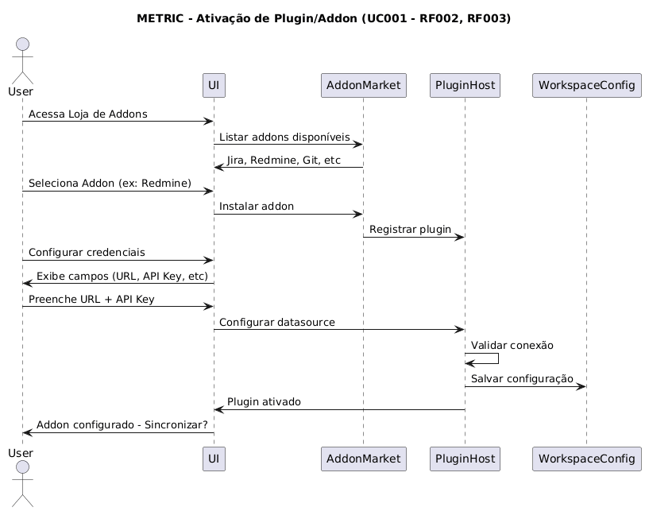

###### diagram-flow-005-sync-success.puml
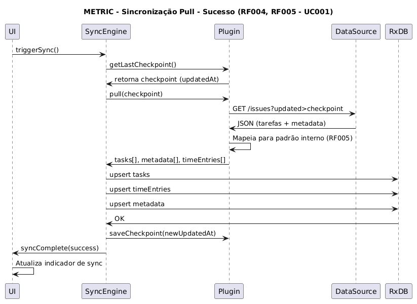

###### diagram-flow-006-sync-conflict.puml
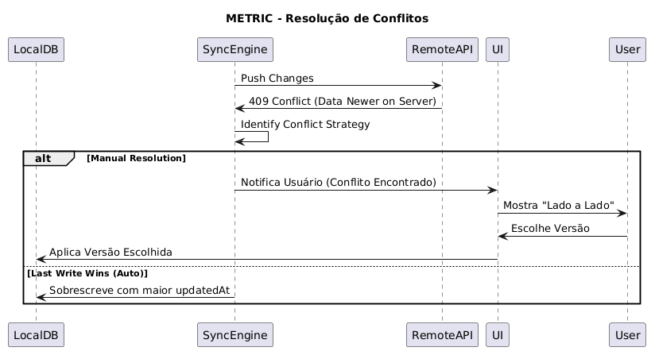

###### diagram-flow-007-payment-pro.puml
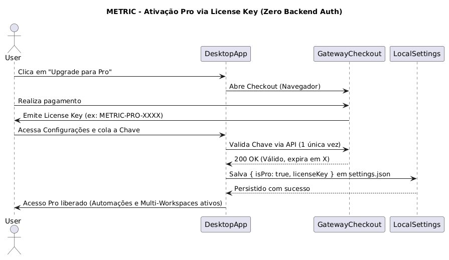
<!--END_FLOW -->

## UC002 — Rastreamento de Tempo

### Objetivo

Permitir que o usuário registre tempo em tarefas com suporte a modos de operação distintos, tempo inicial manual e histórico auditável.

### Fluxo

1. Usuário seleciona tarefa
2. Opcionalmente define tempo inicial (ex: "já trabalhei 2h nisso")
3. Inicia timer — renderer cria entry no RxDB com `timeStatus: running` e primeira entrada no `journal`, e aciona o processamento no Main Process via IPC
4. Main Process passa a processar o interval e emitir `timer:tick` a cada 1s para o renderer
5. Usuário pausa ou finaliza — renderer atualiza o RxDB, journal é registrado; no stop, `timeSpent` é consolidado localmente e o apontamento fica disponível para push ao datasource externo

### Sub-fluxos do Timer

**UC-T01 — Iniciar Timer (padrão)**

```
Usuário clica Play
  │
  ├─ Renderer cria entry no RxDB
  │    startDate: now
  │    timeStatus: running
  │    timerConfig: { mode }
  │    journal: [{ event: 'started', at: now, secondsAtEvent: 0 }]
  │
  └─ Renderer envia ao Main Process via IPC
       timer:start({ initialSeconds: 0, mode })
         └─ Main Process inicia interval → timer:tick a cada 1s → renderer atualiza display
```

**UC-T02 — Iniciar Timer com Tempo Manual**

```
Usuário define "6h" e clica Play
  │
  ├─ Renderer calcula startDate = now - 21600
  │
  ├─ Renderer cria entry no RxDB
  │    startDate: calculado retroativamente
  │    timeStatus: running
  │    timerConfig: { mode, manualInitialSeconds: 21600 }
  │    journal: [{ event: 'adjusted', at: now, secondsAtEvent: 21600,
  │               note: 'Usuário definiu 6h manualmente' }]
  │
  └─ Renderer envia ao Main Process: timer:start({ initialSeconds: 21600, mode })
```

**UC-T03 — Pausar Timer**

```
Usuário clica Pause
  │
  ├─ Renderer envia timer:pause ao Main Process → interval interrompido
  │
  └─ Renderer atualiza RxDB
       timeStatus: paused
       journal: push { event: 'paused', at: now, secondsAtEvent }
```

<!--END_FLOW -->

## UC002 — Rastreamento de Tempo

### Objetivo

Permitir que o usuário registre tempo em tarefas com suporte a modos de operação distintos, tempo inicial manual e histórico auditável.

### Fluxo

1. Usuário seleciona tarefa
2. Opcionalmente define tempo inicial (ex: "já trabalhei 2h nisso")
3. Inicia timer — renderer cria entry no RxDB com `timeStatus: running` e primeira entrada no `journal`, e aciona o processamento no Main Process via IPC
4. Main Process passa a processar o interval e emitir `timer:tick` a cada 1s para o renderer
5. Usuário pausa ou finaliza — renderer atualiza o RxDB, journal é registrado; no stop, `timeSpent` é consolidado localmente e o apontamento fica disponível para push ao datasource externo

### Sub-fluxos do Timer

**UC-T01 — Iniciar Timer (padrão)**

```
Usuário clica Play
  │
  ├─ Renderer cria entry no RxDB
  │    startDate: now
  │    timeStatus: running
  │    timerConfig: { mode }
  │    journal: [{ event: 'started', at: now, secondsAtEvent: 0 }]
  │
  └─ Renderer envia ao Main Process via IPC
       timer:start({ initialSeconds: 0, mode })
         └─ Main Process inicia interval → timer:tick a cada 1s → renderer atualiza display
```

**UC-T02 — Iniciar Timer com Tempo Manual**

```
Usuário define "6h" e clica Play
  │
  ├─ Renderer calcula startDate = now - 21600
  │
  ├─ Renderer cria entry no RxDB
  │    startDate: calculado retroativamente
  │    timeStatus: running
  │    timerConfig: { mode, manualInitialSeconds: 21600 }
  │    journal: [{ event: 'adjusted', at: now, secondsAtEvent: 21600,
  │               note: 'Usuário definiu 6h manualmente' }]
  │
  └─ Renderer envia ao Main Process: timer:start({ initialSeconds: 21600, mode })
```

**UC-T03 — Pausar Timer**

```
Usuário clica Pause
  │
  ├─ Renderer envia timer:pause ao Main Process → interval interrompido
  │
  └─ Renderer atualiza RxDB
       timeStatus: paused
       journal: push { event: 'paused', at: now, secondsAtEvent }
```

**UC-T04 — Retomar Timer**

```
Usuário clica Play (entry pausado)
  │
  ├─ Renderer lê secondsAtLastPause do journal
  ├─ Renderer calcula novo startDate = now - secondsAtLastPause
  │
  ├─ Renderer atualiza RxDB
  │    timeStatus: running
  │    startDate: novo valor calculado
  │    journal: push { event: 'resumed', at: now, secondsAtEvent }
  │
  └─ Renderer envia ao Main Process: timer:start({ initialSeconds: secondsAtLastPause, mode })
```

**UC-T05 — Parar Timer**

```
Usuário clica Stop
  │
  ├─ Renderer envia timer:stop ao Main Process → interval encerrado
  │
  ├─ Renderer consolida timeSpent a partir dos segundos acumulados
  │
  ├─ Renderer atualiza RxDB
  │    timeStatus: finished
  │    endDate: now
  │    timeSpent: valor consolidado
  │    journal: push { event: 'stopped', at: now, secondsAtEvent }
  │
  └─ Apontamento disponível para push ao datasource externo (manual)
```

**UC-T06 — Countdown Zerou**

```
Main Process detecta zero
  │
  └─ Emite timer:finished ao renderer
       └─ Renderer trata como UC-T05 internamente
            (notificação, stop automático, callback visual)
```

**UC-T07 — Boot Recovery**

```
App abre
  │
  └─ Query: timeEntries.findOne({ timeStatus: 'running' })
       │
       ┌─ Achou ────────────────────────────────────────────────────┐
       │  initialSeconds = now - entry.startDate                    │
       │  mode = entry.timerConfig?.mode ?? 'countup'               │
       │  Renderer envia timer:start({ initialSeconds, mode })      │
       │  Main Process retoma processamento                         │
       │  Display exibe o valor correto imediatamente               │
       │  Nenhuma entrada adicional no journal                      │
       └────────────────────────────────────────────────────────────┘
       │
       ┌─ Não achou ─────────────────────────────────────────────────┐
       │  Timer fica idle, nada acontece                             │
       └─────────────────────────────────────────────────────────────┘
```

### Diagrama de Componentes

<!--<BEGIN_COMPONENT_DIAGRAM> -->
###### diagram-component-001-custom-extensions.puml
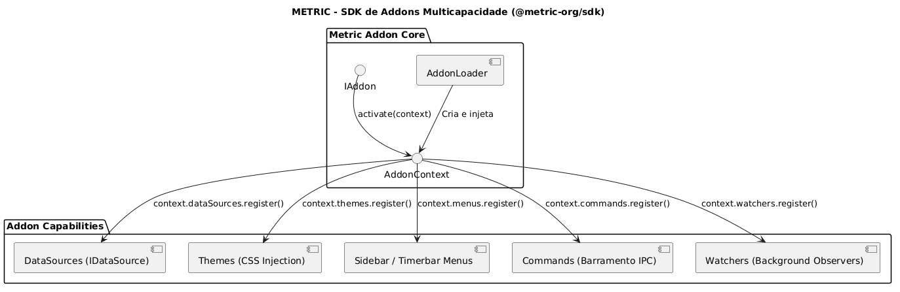

###### diagram-component-002-addons-market.puml
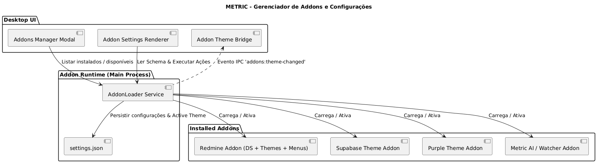

###### diagram-component-003-shared-ui.puml
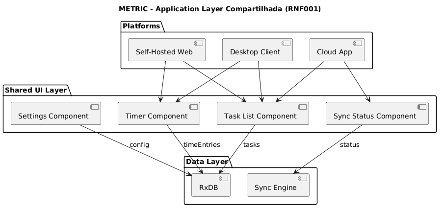
<!--END_COMPONENT_DIAGRAM -->

## UC003 — Ativação de Licença Pro

### Objetivo

Ativar os recursos do plano Pro localmente através de uma chave de licença (License Key).

### Fluxo

1. Usuário realiza o upgrade/pagamento via Checkout Web
2. Gateway emite a Chave de Licença (License Key)
3. Usuário acessa as Configurações do Metric e insere a Chave
4. Sistema valida a chave via API (1 única vez) e grava `{ isPro: true }` no `settings.json` local
5. Recursos Pro (Automações, Watchers, Multi-Workspaces) são desbloqueados imediatamente

---

# Diagrama de Infraestrutura

<!--<BEGIN_INFRA_DIAGRAM> -->
###### diagram-infra-001-architecture.puml
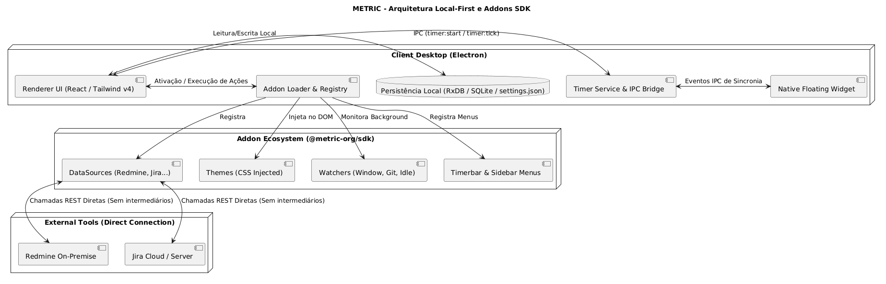

###### diagram-infra-002-deployment-desktop.puml
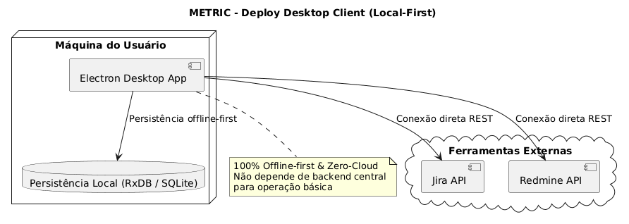

###### diagram-infra-003-sync-engine.puml
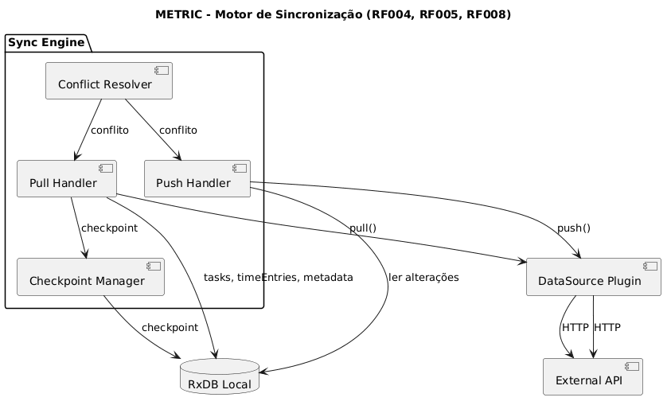

###### diagram-infra-004-rxdb-setup.puml
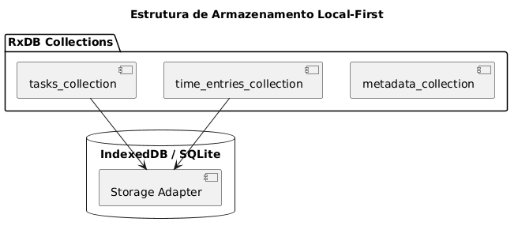
<!--END_INFRA_DIAGRAM -->

---

# Diagrama de Integrações

<!--<BEGIN_INTEGRATION_DIAGRAM> -->
###### diagram-integration-001-jira.puml
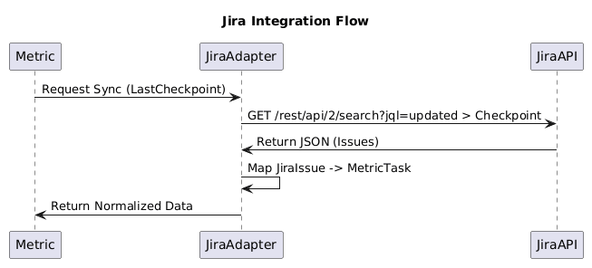

###### diagram-integration-002-redmine.puml
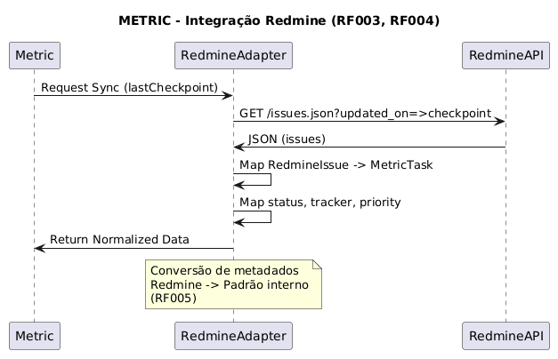

###### diagram-integration-003-other-datasources.puml
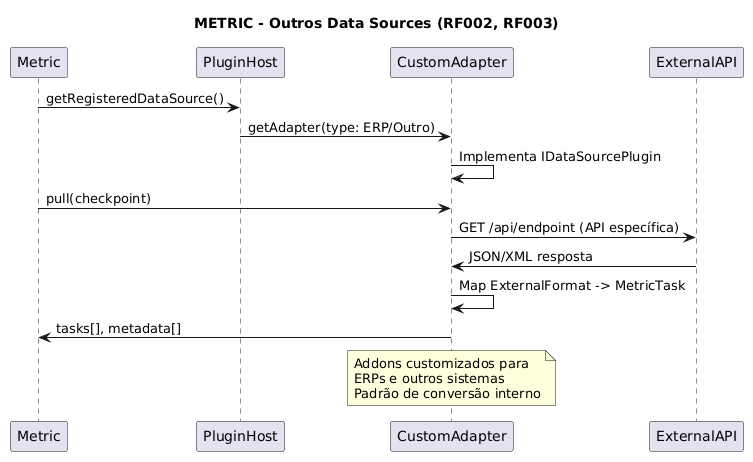

###### diagram-integration-004-sync-pull.puml
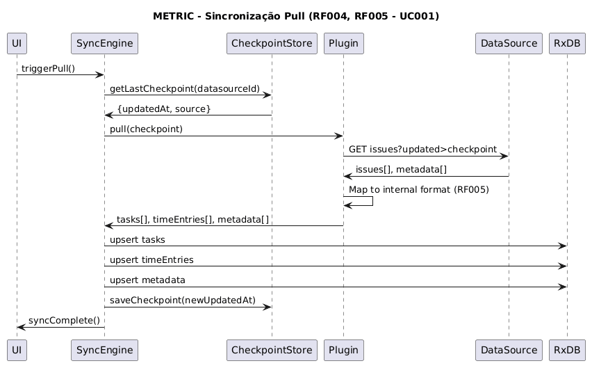

###### diagram-integration-005-sync-replication.puml
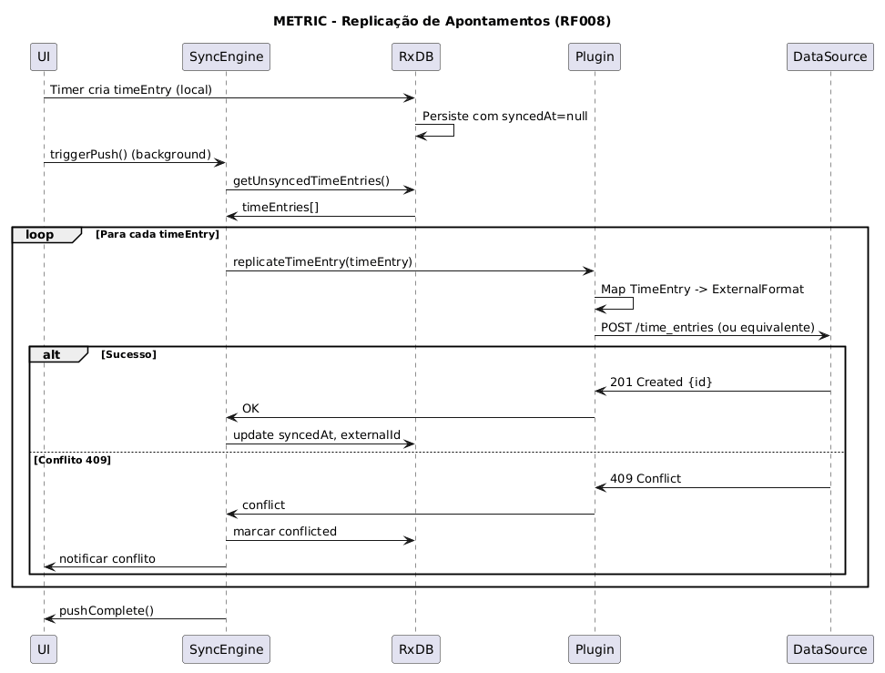
<!--END_INTEGRATION_DIAGRAM -->

---

# Diagrama de UML

<!--<BEGIN_UML_DIAGRAM> -->
###### diagram-uml-001-use-case-setup.puml
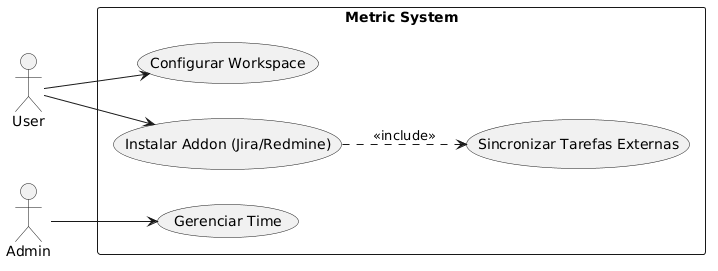

###### diagram-uml-002-use-case-timer.puml
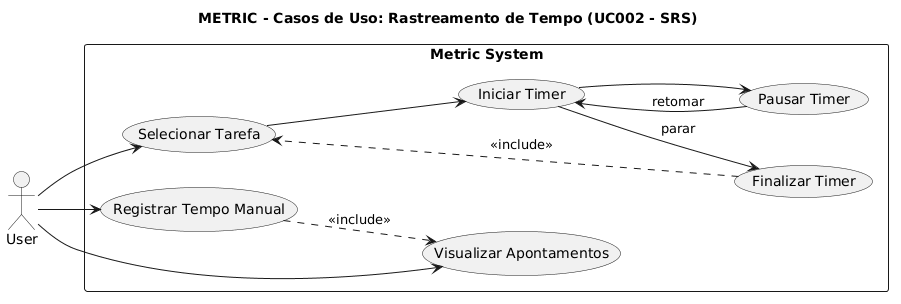

###### diagram-uml-003-sequence-sync.puml
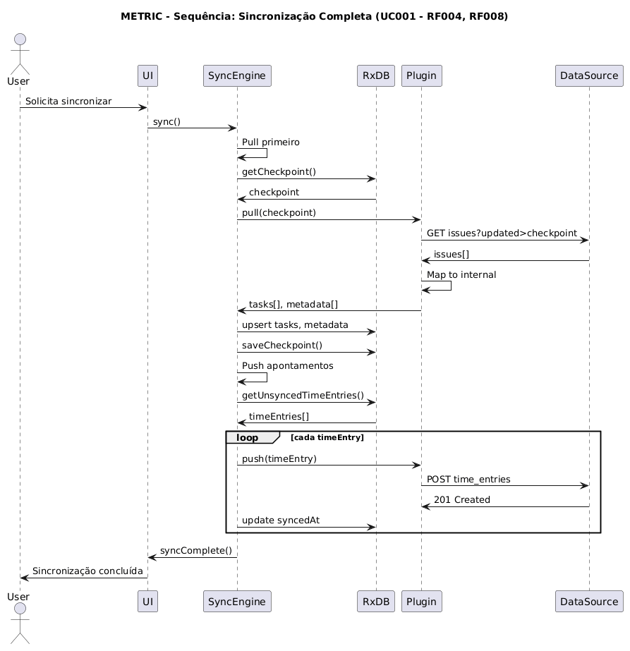

###### diagram-uml-004-sequence-payment.puml
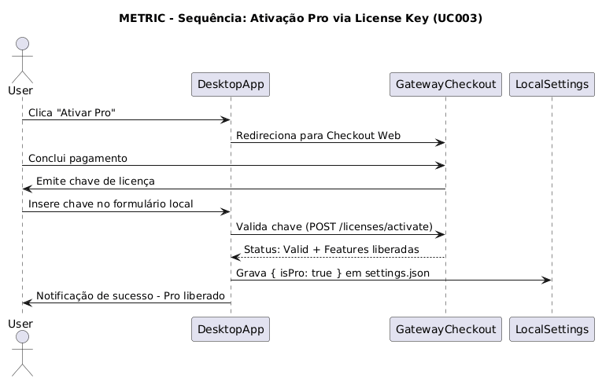

###### diagram-uml-005-component-overview.puml
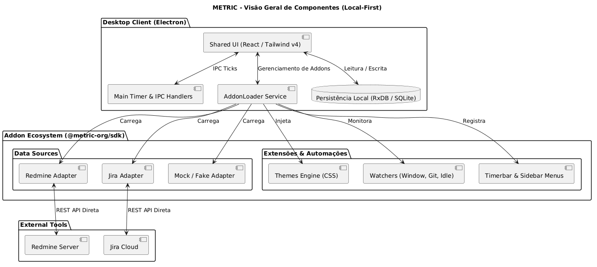
<!--END_UML_DIAGRAM -->

---

# Diagrama de Infraestrutura e Componentes (Mermaid)

```mermaid
flowchart TB
    subgraph Client [Desktop Client — Electron]
        direction TB
        UI[Renderer UI — React & Tailwind v4]
        TimerService[Main Timer Service & IPC]
        Loader[AddonLoader & Memory Registry]
        LocalDB[(RxDB / SQLite / settings.json)]
        Widget[Native Transparent Widget]

        UI <--> TimerService
        UI <--> LocalDB
        TimerService <--> Widget
        UI <--> Loader
    end

    subgraph Addons [Addon Ecosystem — @metric-org/sdk]
        direction TB
        DS[DataSources — Redmine, Jira, Fake]
        Themes[Visual Themes — CSS Injected]
        Watchers[Watchers — Window, Git, Idle]
        Menus[Timerbar & Sidebar Menus]

        Loader --> DS
        Loader --> Themes
        Loader --> Watchers
        Loader --> Menus
    end

    subgraph External [External Tools — Direct REST]
        direction TB
        RedmineServer[Redmine Server / On-Premise]
        JiraServer[Jira Cloud API]

        DS <--> RedmineServer
        DS <--> JiraServer
    end

        end

        subgraph AppCore [Application Core]
            direction TB
            SharedUI[Shared UI]
            RxDB[(RxDB Local Database)]
            Sync[Sync Engine]
            TimerService[Timer Service — Main Process]

            SharedUI --> RxDB --> Sync
            SharedUI -- IPC --> TimerService
            TimerService -- timer:tick --> SharedUI
        end

        subgraph Integrations [Integrations]
            direction TB
            subgraph DataSources [Data Sources]
                Jira[Jira]
                Redmine[Redmine]
                Other[Other Systems]
            end

            subgraph Plugins [Plugins]
                Clock[Time Clock Plugin]
                Git[Git Activity Plugin]
                Ext[Custom Extensions]
            end
        end
    end

    Desktop & Mobile & SelfHosted --> Auth
    Desktop & Mobile & SelfHosted --> Orgs
    Desktop & Mobile & SelfHosted --> Lic
    Desktop & Mobile & SelfHosted --> SharedUI
    Sync --> DataSources
    Sync --> Plugins
    LeftColumn ~~~ RightColumn
```

---

# Decisões de Arquitetura Registradas (ADR)

## ADR-001 — Timer processado no Main Process

**Contexto:** O Chromium throttla `requestAnimationFrame` e `setInterval` em janelas/abas em background, causando drift no timer quando o usuário minimiza o app. Além disso, concentrar o processamento temporal no renderer acoplaria a confiabilidade do timer ao ciclo de vida da janela.

**Decisão:** O processamento do timer roda no Main Process do Electron via `setInterval`. O renderer é responsável por controlar o ciclo de vida (play, pause, stop) e por exibir os valores recebidos. O Main Process é responsável por calcular os segundos decorridos e emiti-los via IPC.

**Consequências:**

- Timer imune a throttling do Chromium
- Processamento temporal isolado do estado visual
- Abre espaço para captura de janela ativa, idle detection e outras funcionalidades de background no futuro
- Renderer simplificado — recebe valores prontos, não calcula tempo

## ADR-002 — `startDate` como âncora universal

**Contexto:** Com pausa, retomada e tempo manual, seria necessário acumular múltiplos fragmentos de tempo para calcular o total correto. Isso aumentaria a complexidade do boot recovery e da reconstrução do estado.

**Decisão:** O `startDate` é recalculado retroativamente a cada retomada (`startDate = now - secondsAtMoment`). Isso mantém a fórmula de reconstrução sempre simples: `now - startDate`.

**Consequências:**

- Display e boot recovery usam sempre a mesma fórmula
- `startDate` não representa necessariamente o momento real de início do trabalho (documentado no journal via evento `adjusted` ou `resumed`)
- O adapter de push recebe `startDate` + `endDate` sem precisar conhecer os fragmentos internos de pausa e retomada

## ADR-003 — Journal e timerConfig são dados locais

**Contexto:** O datasource externo não precisa e não deve receber dados de controle interno do timer. Esses dados representam o estado operacional local e não fazem parte do modelo de domínio sincronizável.

**Decisão:** `journal` e `timerConfig` são campos do RxDB excluídos da estratégia de replicação. Nunca trafegam para datasources externos.

**Consequências:**

- Privacidade do fluxo de trabalho interno do usuário
- O adapter de push trabalha apenas com campos do modelo de domínio (`startDate`, `endDate`, `timeSpent`, `comments`)
- Dados de auditoria e recálculo disponíveis localmente para futuras funcionalidades

## ADR-004 — Sistema de Addons Multicapacidade desacoplado via SDK

**Contexto:** Ferramentas extensíveis costumam sofrer de fragmentação ou acoplamento forte quando cada tipo de plugin (tema, conector, atalho) exige uma arquitetura isolada.

**Decisão:** O Metric adota um contrato de **Addon Multicapacidade** no `@metric-org/sdk`. Um único Addon pode registrar simultaneamente DataSources, Menus de Sidebar, Botões e Popovers na Timerbar, Comandos, Watchers e Temas Visuais.

**Consequências:**
- Facilidade para a comunidade e empresas desenvolverem extensões completas.
- O Core do Metric e a UI permanecem 100% agnósticos aos detalhes das ferramentas externas.

## ADR-005 — Licenciamento Local-First por Chave (Zero Backend Auth)

**Contexto:** Criar um backend SaaS de autenticação (Magic Links, senhas, banco de usuários) introduz custos de infraestrutura e aumenta o risco de vazamento de dados de compliance de clientes corporativos.

**Decisão:** O licenciamento PRO opera no modelo **License Key Offline-First**. A chave adquirida no checkout é validada e persistida localmente nas configurações do app. O app opera 100% funcional localmente sem obrigatoriedade de login.

**Consequências:**
- Zero custo e manutenção de servidores de autenticação centralizados.
- Cumprimento rigoroso da política de privacidade Zero-Cloud.

## ADR-006 — Injeção Dinâmica e Tratamento de Temas CSS no Client-Side

**Contexto:** O Tailwind v4 compila estilos em build-time com diretivas específicas (`@theme`, `@apply`) que o motor CSS nativo do navegador não interpreta em runtime.

**Decisão:** O `AddonThemeBridge` extrai dinamicamente apenas as variáveis CSS dos blocos `:root` e `.dark` fornecidos pelo Addon, descartando diretivas de build e aplicando-as com seletores de alta especificidade (`:root:root` e `.dark:root`).

**Consequências:**
- Addons podem fornecer arquivos `.css` completos no padrão Shadcn/Tailwind sem quebrar o runtime.
- Suporte a alternância de temas em tempo real na janela principal e no widget flutuante.
